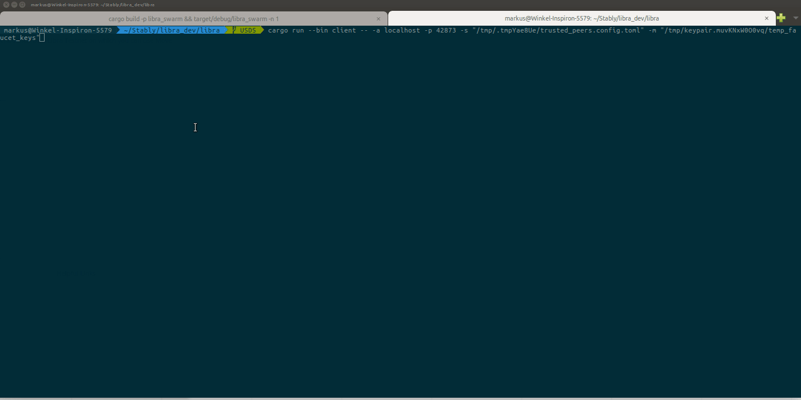

<h1>StableUSD on Libra</h1>

This Repo extends the [eToken standard](https://github.com/etoroxlabs/etoken-libra) in Move IR from Dr. Omri Ross and
uses the Client functionalities from [here](https://github.com/jolestar/libra/tree/hack/client) to implement [USDS](http://www.stably.io) on Libra.

We have added burn functionalities to the standard and plan on adding more useful features and functional tests in the future.

Read more about the project [here](https://github.com/libra/libra) and get installation instructions from [here](https://developers.libra.org/docs/my-first-transaction)

## Example:



## Commands:
```bash
#build and run the docker swarm
cargo build -p libra_swarm && target/debug/libra_swarm -n 1

#copy the output and run the client from another terminal
cargo run --bin client -- -a localhost -p 43797 -s "/tmp/.tmpGq9Tax/trusted_peers.config.toml" -m "/tmp/keypair.RcBHzaGV5r90/temp_faucet_keys"

# create first account
account create

#mint libra to first account
account mint 0 1000
query account_state 0

#initialie and mint USDS to the first account
usds issue 0
usds mint 0 100
usds account_state 0

#burn USDS
usds burn 0 50
usds account_state 0

# create second account
account create

#mint libra to second account to pay for init fee
account mint 1 1000
query account_state 1

#initialize and transfer USDS to the second account
usds init 1
usds transfer 0 1 10
usds account_state 0
usds account_state 1
```